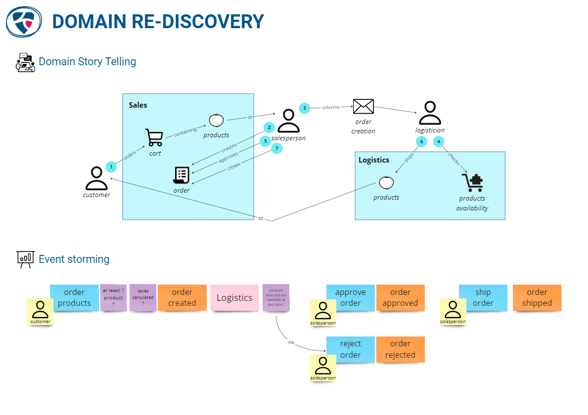

# Domain Driven Refactorings

(in python)

This repository is used as live coding starter to
apply [Domain Driven Refactorings](https://hschwentner.io/domain-driven-refactorings/) on
an [anemic domain model](https://hschwentner.io/domain-driven-refactorings/tactical/heal-entity-anemia)

## Instructions

Here you find a simple order flow application. It's able to create orders, do some calculation (totals and taxes), and
manage them (approval/reject and shipment).

The old development team did not find the time to build a proper domain model but instead preferred to use a procedural
style, building this anemic domain model.
Fortunately, they did at least take the time to write unit tests for the code.

Your new CTO, after many bugs caused by this application, asked you to refactor this code to make it more maintainable
and reliable.

### How to ?

Your team started Domain Re-discovery workshops using Event Storming and Domain Storytelling.

As a result, it produced the following aggregate design canvas:

You can kow start applying Domain Driven Refactorings to heal the Anemic Domain Model, following this steps:

1. Replace technical names with domain language
   using [Enforce Ubiquitous Language](https://hschwentner.io/domain-driven-refactorings/tactical/enforce-ubiquitous-language)
2. Create a Price value object
   using [Replace Primitive with Value Object](https://hschwentner.io/domain-driven-refactorings/tactical/replace-primitive-with-value-object)
3. Enforce price invariants and secure its operations
   using [Introduce Contract](https://hschwentner.io/domain-driven-refactorings/tactical/introduce-contract)
4. Heal the entities anemia:
    1. Move tax computation into Order and OrderItem
       using [Move Logic from Service to Entity](https://hschwentner.io/domain-driven-refactorings/tactical/move-logic-from-service-to-entity)
    2. Enforce encapsulation of entities data
       using [Remove Setter](https://hschwentner.io/domain-driven-refactorings/tactical/remove-setter)
       and [Replace Setter with Domain-Named Method](https://hschwentner.io/domain-driven-refactorings/tactical/replace-setter)

### Steps branches

You can checkout each `steps/*` branch to get an example result or a starting point for the next one.

## Credits

### Contributors

[Julien VITTE](https://github.com/pitchart/) & [Marie-Eugénie MECHAIN](https://github.com/me-mechain)

[You ?](https://github.com/pitchart/domain-driven-refactorings-in-python/pulls)

### Tell Don't ask kata

The original source code is the [Tell don't ask kata](https://github.com/racingDeveloper/tell-dont-ask-kata)
by [Gabriele Tondi](https://github.com/racingDeveloper)
